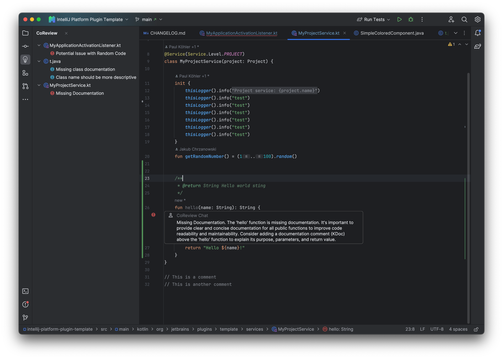

# CoReview

An AI Assistant for you Pre-Commit code review.

> [!IMPORTANT]
> This project was created as part of hackaTUM 2023. \
> This is a hacking project created in just 36hours. This project does not try to be a perfect plugin! \
> It's not meant to be used in production. Please don't try to use it in production.

## Inspiration

`CoReview` was an idea born as a result of our own experiences with code reviews.
We realized that code reviews are an essential part of the development process.
However, we also understood that code reviews can be time-consuming and tedious.
We wanted to create a tool that would simplify the review process and improve overall code quality.
We think that `CoReview` is a solution to the _nitpicking issues_ that plague code reviews.
And so we set our goal:

> We want to help developers focus on the important parts of code reviews.

## What it does

<!-- Plugin description -->
`CoReview` is an AI-based (OpenAI GPT-3.5) automated code review plugin that intelligently scans your uncommitted
changes, providing instant feedback and improving overall code quality beyond what a static linter can
provide. `CoReview` identifies potential issues, ensures adherence to coding standards, and fosters a more productive
development environment.
<!-- Plugin description end -->

## How to use it

Install the plugin from the Jetbrains Plugin Marketplace (coming soon™) or build it from source. You need to provide an
OpenAI API key in your settings. After that, you can use the plugin by clicking on
the `CoReview` () button in the
Commit Window. Or by adding `CoReview` to your pre commit checks. `CoReview` will then analyze your changes and provide
you with suggestions on how to improve your code.

## The Team

We are 4 students with a computer science background. We are passionate about software development and
the IDEs from Jetbrains are our daily tools for getting our work done (and also our degrees).

## How we built it

We built `CoReview` as a plugin for the Jetbrains family of IDEs.
We integrated the OpenAI GPT-3.5 API using `langchain4j` to provide users with a simple in-editor experience.
The Jetbrains Plugin SDK and Kotlin were used to develop the plugin.
Even though we had no prior experience with the Jetbrains Platform SDK (and Kotlin btw.), we were able to create a
working
prototype in such a short amount of time.

## Challenges we ran into

The problems we ran into were twofold:

- At first, we had no idea how to create a plugin for Jetbrains IDEs. We had to learn the basics of the Jetbrains
  Platform SDK as well as Kotlin.
- We also had to learn how to use the OpenAI API and how to integrate it into our plugin. We had little to no prior
  experience with AI and how to integrate it into applications.

## Accomplishments that we're proud of

We are really proud of what we achieved in this short amount of time, especially with our severely limited experience.
The surprising amount of finishing touches we were able to get done in a very short amount of time is also something we
are really happy about. We think that we created a really cool experience that could actually be useful with a little
more work and polish.

## What we learned

Throughout the development of `CoReview`, we gained valuable insights into the intricacies of how our daily tools work.
We learned how to use the Jetbrains Platform SDK and Kotlin to create a plugin for Jetbrains IDEs.
We especially learned how mighty an extensible IDE can be. We also learned how to use the OpenAI API
and how to integrate it into software.

## What's next for `CoReview`

The journey doesn't end here. We envision `CoReview` evolving by incorporating more advanced AI features,
like giving more context to the AI and making a discussion about the code comments possible. We think that `CoReview`
would be even more helpful if you could chat with your AI reviewer about their comments.
Also, we'd like to incorporate code change suggestions into the plugin.

`CoReview` could also go beyond your commit: We think `CoReview` could make working with PRs (Merge Requests) even
more productive.

